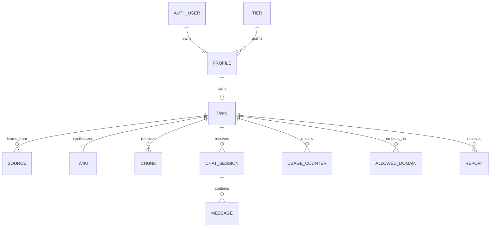
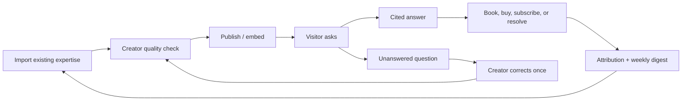
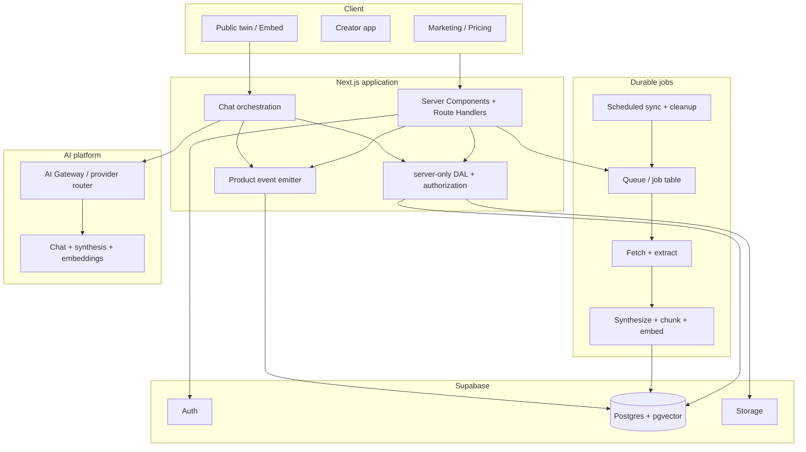

# hiy.ai — System Design and Product Review

**Review date:** 22 July 2026  
**Stage:** Pre-launch development  
**Scope:** Product strategy, UI/UX, accessibility, application behavior, architecture, data model, AI/RAG design, security, privacy, reliability, testing, operations, monetization, and launch readiness.

## Executive decision

hiy is a coherent and unusually complete prototype. The no-account preview is an excellent activation mechanism, the ingestion layer is thoughtfully hardened, and “cited, honest-by-default answers” is a clearer point of view than most generic AI-twin products.

It is not ready for an open public or paid launch.

The recommended next step is a **closed, paid design-partner beta** for 10–20 independent coaches, consultants, and course creators who already have a meaningful content library and receive repeated pre-sale or client questions. Do not launch four speculative plans yet. First prove that the product creates a measurable business outcome: qualified conversations, reduced repetitive support, or converted leads.

The strongest product thesis is:

> hiy turns an expert’s existing content into trustworthy, cited answers that qualify and help visitors without risking the expert’s reputation.

“Honesty” is a valuable trust mechanism, but it is not by itself the outcome customers will pay for. The product must connect a trustworthy answer to a creator outcome: a captured lead, a booked call, a product recommendation, or a resolved support question.

## Readiness scorecard

| Area | Score | Assessment |
|---|---:|---|
| Product concept | 7/10 | Clear demo value and a credible trust angle |
| Core functionality | 6/10 | Broad feature coverage, but several critical journeys are incomplete |
| UI/UX | 5/10 | Polished baseline; high cognitive load and important mobile/a11y gaps |
| Architecture | 6/10 | Appropriate modular monolith; synchronous and destructive indexing limits production safety |
| Security and privacy | 3/10 | Good validation/RLS foundations, but public cost controls, privacy, takedown, and SSRF gaps remain |
| Reliability and operations | 3/10 | Build passes; no production-grade jobs, observability, CI, or runtime acceptance suite |
| Commercial readiness | 2/10 | Pricing exists, but billing and several advertised entitlements do not |
| Overall launch readiness | 3/10 | Suitable for a controlled beta after launch gates; not suitable for broad traffic |

## What is already strong

- The no-account instant preview makes an abstract product understandable in one interaction.
- The ingestion layer has typed errors, streaming size limits, URL validation, redirect checks, timeouts, and a designed YouTube transcript fallback.
- Zod validation and explicit ownership checks are present on most mutation routes.
- Supabase RLS is enabled broadly, and the vector retrieval RPC is removed from public roles.
- Persona affects style without being allowed to override factual grounding.
- Missing provider keys degrade intentionally instead of producing mysterious failures.
- The public AI disclosure, “I don’t know” treatment, correction source, knowledge-gap queue, and abuse-report link support one coherent trust story.
- Reduced-motion behavior and Radix dialog primitives provide a better accessibility base than most prototypes.
- The production build succeeds and the current 63 local checks pass.

## Launch blockers

### P0 — Preview creation does not convert into ownership

The public page says a visitor can sign up to keep a 24-hour preview, but ephemeral twins are unowned and there is no claim or transfer operation. Sign-up creates a separate permanent twin. The product’s strongest “wow → account” loop therefore ends in data loss.

Required behavior:

1. Create the preview with a one-time, hashed claim token.
2. Carry the token through sign-up/email confirmation.
3. Let the authenticated user choose a permanent slug.
4. Atomically transfer ownership and retain sources, wiki, persona, chunks, and chat sample.
5. Invalidate the token and record the claim event.

Primary evidence: `src/app/api/instant/route.ts`, `src/app/[slug]/page.tsx`, and `src/app/api/twin/route.ts`.

### P0 — The public promise, plans, and implementation disagree

Examples:

- The pricing FAQ promises export and deletion, but neither workflow exists.
- Pricing says Starter uploads are 5 MB; the file ingester accepts 20 MB.
- Pricing presents embed as a Plus feature; the dashboard and database include inline embed on free.
- Pricing names a Studio plan; migrations seed Business.
- Pro advertises bring-your-own model keys; no secure key-management path exists.
- “Every answer cites” currently means up to three source-title labels, not passage-level, clickable evidence.
- Paid CTAs are not purchasable, and “Most popular” is applied to an unavailable plan.

Before any public launch, generate pricing and entitlement copy from one shared plan definition and remove every unimplemented promise.

## Current system design

### Context diagram

```mermaid
flowchart LR
  Creator[Creator] --> Web[Next.js 16 app]
  Visitor[Visitor] --> Web
  Web --> Auth[Supabase Auth]
  Web --> DB[(Supabase Postgres + pgvector)]
  Web --> Storage[Supabase Storage]
  Web --> OpenAI[OpenAI embeddings/chat fallback]
  Web --> Anthropic[Anthropic chat/synthesis]
  Web --> Internet[Creator URLs, blogs, YouTube]
  Host[Creator website] --> Embed[/embed/:slug iframe]
  Embed --> Web
```

### Runtime shape

The app is a Next.js App Router modular monolith:

- Server Components perform authenticated dashboard and public-profile reads.
- Route Handlers perform mutations, ingestion, indexing, chat, and reporting.
- Supabase provides authentication, Postgres, pgvector, RLS, and avatar storage.
- The server-side service-role client bypasses RLS for orchestration.
- Anthropic is preferred for chat/synthesis; OpenAI is the fallback and embedding provider.
- Indexing and synthesis run synchronously inside request lifetimes.

This is the right deployment unit for the current team and product stage. The problem is not the monolith; it is that long-running jobs, privileged database access, authorization, and request handling are too tightly mixed.

### Current creator flow

```mermaid
sequenceDiagram
  actor C as Creator
  participant UI as Next.js UI
  participant API as Route Handler
  participant DB as Supabase
  participant AI as LLM/Embeddings

  C->>UI: Sign up / sign in
  UI->>DB: Supabase Auth
  C->>API: Claim username and create twin
  API->>DB: Insert profile + draft twin
  C->>API: Add source
  API->>API: Fetch/extract/clean
  API->>DB: Insert source; set indexing
  API->>AI: Synthesize wiki + embed chunks
  API->>DB: Delete old chunks; insert new chunks
  API->>DB: Set twin live
  API-->>C: Source added
```

Important current behavior: the first successful source automatically makes the twin public. There is no private test-and-publish checkpoint.

### Current visitor-chat flow

```mermaid
sequenceDiagram
  actor V as Visitor
  participant UI as TwinChat
  participant API as /api/chat
  participant DB as Supabase
  participant AI as LLM provider

  V->>UI: Ask question
  UI->>API: slug, message, client history, optional session UUID
  API->>DB: Load twin and caps
  API->>DB: Read then increment quota
  API->>DB: Create/reuse session; store question
  API->>AI: Embed query
  API->>DB: pgvector retrieval
  API->>AI: Stream grounded response
  API-->>UI: Text stream + source-title headers
  API->>DB: Store answer on finish
```

### Data model



### Implemented functionality

- Landing and pricing surfaces.
- Email/password and Google authentication.
- Username claim and one-twin onboarding.
- No-account previews from text or an article URL.
- Manual text, LinkedIn/résumé, article, YouTube, PDF, DOCX, TXT, and Markdown ingestion.
- Sitemap/RSS and YouTube-channel discovery with bulk import.
- Wiki synthesis, chunking, embeddings, pgvector retrieval, and streamed chat.
- Personality interview, adaptive gap questions, persona synthesis, corrections, and topic guardrails.
- Public creator profile, avatar, links, greeting, suggested questions, and accent color.
- Public links, deep-linked questions, iframe embed, simple analytics, and abuse reports.

### Incomplete or unsafe behavior

- Preview claim/transfer is missing.
- Billing, subscription state, webhooks, and upgrades are missing.
- Export, deletion, account recovery, retention controls, and visitor-data requests are missing.
- One twin per account is checked in application code but is not a database uniqueness invariant.
- Bulk import ignores the final reindex response and can report success after failure.
- Reports have no status, assignment, notification, moderation UI, or insert-error handling.
- Allowed embed domains are stored but not enforced.
- There is no explicit publish/unpublish or private preview gate.
- Scheduled source synchronization is absent despite “sync” language.
- Analytics are based on only the latest 400 messages and English regex matching.
- Missing twin/embed routes fall through to an unhelpful default 404.

## Technical risk review

### P1 — Cost controls are process-local and non-atomic

The in-memory rate limiter resets across function instances and deployments. Message caps and source caps use read-then-write logic, so concurrent requests can overshoot. The unauthenticated preview endpoint can fetch remote content, call synthesis, create embeddings, and store rows, making it an expensive abuse surface.

Required changes:

- Use a distributed limiter keyed by hashed IP plus account/twin identifiers.
- Implement atomic quota reservation in Postgres RPCs or transactions.
- Reserve spend before model work and finalize/refund based on the result.
- Add per-key budgets and alerts at the model gateway/provider level.
- Require CAPTCHA or proof-of-work after a low anonymous preview threshold.
- Clean up expired previews and partial failed previews on a schedule.

### P1 — Reindexing is destructive, synchronous, and non-transactional

The current index is deleted before all replacement chunks are inserted. A timeout or insertion failure can leave a live twin with no index or a partial one. Multiple reindexes can race. Re-synthesizing every source after every change also creates O(n²)-like cost over a growing corpus.

Required changes:

- Move ingestion/indexing to idempotent background jobs.
- Write chunks under a new `index_version`.
- Validate row count and embeddings before publication.
- Atomically flip `twins.active_index_version` only after success.
- Retain the previous version for rollback, then garbage-collect it later.
- Use source versions and incremental indexing rather than rebuilding the entire corpus for every source.

### P1 — Paid-scale corpus limits exceed actual synthesis behavior

Wiki synthesis truncates the combined corpus at 400,000 characters while plans advertise hundreds of thousands or millions of words. Because corrections are placed last, truncation can omit the authoritative information the system claims will override older facts.

Do not advertise large-corpus tiers until the design supports hierarchical or incremental summaries, source-level retrieval, and explicit correction precedence without truncation.

### P1 — Citations are attribution, not evidence

Chunks do not populate `source_id`. The API returns source titles through a response header, and the UI renders them as inert labels. There is no canonical URL, passage, page, paragraph, timestamp, or claim-to-source mapping.

The production citation contract should contain:

```ts
type Citation = {
  sourceId: string;
  sourceTitle: string;
  canonicalUrl: string | null;
  locator: { page?: number; timestampSeconds?: number; heading?: string };
  excerpt: string;
  chunkId: string;
};
```

Answers should stream structured parts or send citations in a final structured event. Each chip should open the cited passage and, where possible, the original source.

### P1 — SSRF protection still permits DNS rebinding

The ingester resolves and checks a hostname, then `fetch()` resolves it again. A hostile hostname can potentially return a public address during validation and a private address at connection time. Use a fetch mechanism that pins the validated address while preserving the original Host/SNI, or route external fetches through an isolated egress service with deny-by-default networking.

### P1 — Chat-session integrity is incomplete

The client can provide any session UUID; the route does not verify that the session belongs to the requested twin or to this visitor. Bind sessions to the twin and a signed, httpOnly visitor token or use an opaque signed session capability. Never accept a bare database UUID as authority.

### P1 — Privacy, deletion, and abuse operations are not launch-ready

The system stores creator content, interviews, visitor questions, AI answers, origin domains, and report contact information. There are no privacy or terms pages, retention schedule, consent notice, export/delete flow, subprocessor disclosure, or operational takedown queue. Reports currently accumulate without creating a response obligation in the product.

Before public beta, define:

- Data inventory, purpose, legal basis, subprocessors, and retention per table.
- Creator export, source deletion, twin deletion, and account deletion.
- Visitor disclosure near the chat input and a deletion/contact path.
- Report workflow with `open`, `triaged`, `actioned`, and `dismissed` states.
- Notification and response targets for impersonation and abuse reports.
- A policy for ephemeral content and conversation retention.

### P1 — Global security headers are absent

The reviewed local responses had no CSP, `nosniff`, referrer policy, frame policy, or permissions policy and exposed `X-Powered-By`. Apply a restrictive default policy to the application and a deliberate `frame-ancestors` policy to `/embed/*`.

### Dependency status

`npm audit` reported one moderate PostCSS advisory and two high Sharp/libvips advisories in the Next.js dependency tree. The project uses Next.js 16.2.10; npm reports 16.2.11 as the current stable patch. Do not run the audit’s suggested forced downgrade. Test the current patch and track upstream remediation.

## UI/UX review

### Method

Two isolated assessments were used: an independent design-director review and a deterministic/browser detector review. Browser evidence covered `/`, `/pricing`, `/app`, and a missing public twin at desktop and mobile sizes.

### Nielsen design health

| # | Heuristic | Score | Main issue |
|---|---:|---:|---|
| 1 | Visibility of system status | 3/4 | Good busy/success states; publishing and indexing transitions remain unclear |
| 2 | Match with the real world | 3/4 | Candid language, but “hiy,” “twin,” “training,” “persona,” and “indexing” mix models |
| 3 | User control and freedom | 2/4 | No undo, explicit publish, or reliable exit from destructive flows |
| 4 | Consistency and standards | 2/4 | Citation and pricing promises do not match behavior |
| 5 | Error prevention | 1/4 | One-click deletion and automatic publication are high-risk defaults |
| 6 | Recognition rather than recall | 2/4 | Mobile dashboard hides six navigation labels; forms rely on placeholders |
| 7 | Flexibility and efficiency | 1/4 | Bulk import helps, but views are not URL-addressable and expert shortcuts are absent |
| 8 | Aesthetic and minimalist design | 3/4 | Cohesive, but card-heavy and familiar AI-SaaS composition |
| 9 | Error recovery | 2/4 | Helpful API copy in places; missing links and some failures are dead ends |
| 10 | Help and documentation | 1/4 | No contextual help, onboarding checklist, privacy explanation, or guidance center |
| **Total** |  | **20/40** | **Acceptable; significant work before launch** |

### Technical UI audit

| Dimension | Score | Main issue |
|---|---:|---|
| Accessibility | 2/4 | Unlabeled fields, low-contrast muted text, small targets, and icon-only mobile nav |
| Performance | 2/4 | Continuous canvas work, synchronous dynamic pages, and no production performance budget |
| Responsive design | 1/4 | Mobile creator navigation is opaque; the captured mobile homepage clipped key hero content |
| Theming | 3/4 | Strong semantic tokens and dark mode; several token combinations fail contrast |
| Anti-patterns | 2/4 | Familiar editorial AI-SaaS lane, nested cards, large soft shadows, and card-heavy sections |
| **Total** | **10/20** | **Acceptable, with major pre-launch fixes** |

### Anti-pattern verdict

**Borderline fail.** The concept has distinctive objects, but the public surface uses a familiar 2026 AI-SaaS grammar: warm wash, editorial serif/italic headline, pill CTAs, rounded white cards, soft shadows, and feature grids. The orb, preview builder, citation evidence, and designed “I don’t know” state are the ownable parts and should carry more of the composition.

The deterministic source scan returned three `overused-font` warnings. These were false positives caused by matching `Inter` inside `Instrument`, and the Instrument family is already a committed identity. Browser detection found credible WCAG contrast failures, 11 px text, nested cards, a wide-shadow/glow pattern on pricing, and a password input outside a semantic form.

### Highest-impact UX changes

1. **Make evidence real.** Clickable citation passages are the product, not a decorative chip.
2. **Add private test → publish.** Never publish after the first successful ingest. Add preview-as-visitor, quality checks, publish, and unpublish.
3. **Turn onboarding into a persisted checklist.** Claim → import → test ten questions → refine gaps → publish → share/embed.
4. **Replace the six-icon mobile rail.** Use a labeled drawer or 3–4 item bottom navigation plus More. Give every control an accessible name.
5. **Use persistent form labels and semantic forms.** Fix sign-in, preview, onboarding, report, profile, behavior, and chat inputs.
6. **Raise muted-text contrast and target sizes.** Normal text needs 4.5:1; common touch targets should be at least 44×44 px.
7. **Design missing/expired states.** A shared-link product cannot end in a generic 404.
8. **Remove unbuyable pricing theater.** One real founder offer or a specific waitlist is more credible than four unavailable tiers.

### Cognitive load

Five of eight checks fail: chunking, one thing at a time, minimal choices, working-memory continuity, and progressive disclosure. The Training screen combines ingestion, bulk import, persona, knowledge-base inspection, and correction. The dashboard presents six peer destinations. Onboarding announces three steps, then loses the sequence.

### Persona failures

- **First-time creator:** sees six dashboard destinations with no guided next step and no help.
- **Accessibility-dependent user:** encounters placeholder-only fields, low contrast, small targets, and icon-only mobile navigation.
- **Distracted mobile creator:** loses useful width to a permanent rail and cannot return to a URL-addressable dashboard state.
- **Stress tester:** can delete without undo, reach dead-end slugs, see a false success after reindex failure, and cannot verify a citation.

## Product strategy

### Choose one initial customer

Do not target “creators, coaches, founders, and experts” equally. Start with:

> English-speaking independent business and career coaches or consultants who sell through booked calls, have at least 50 reusable articles, transcripts, newsletters, or FAQ answers, receive recurring prospect questions, sell an offer worth at least €500, and can send at least 100 relevant visitors to a test page during the beta.

Course creators are the next adjacent segment, not part of the first cohort. Recruit the first cohort through founder-led outreach to coaches and consultants already publishing regularly on LinkedIn, YouTube, or a newsletter; do not begin with broad paid acquisition.

Why this segment:

- Repetitive questions create an obvious pain.
- Reputation makes trustworthy answers valuable.
- Existing content lowers setup friction.
- A booked call or qualified lead has measurable economic value.
- The buyer and content owner are usually the same person.

### Define the job to be done

Bad framing: “Create an AI twin.”  
Better framing: “Let visitors get trustworthy answers from my expertise when I am unavailable.”  
Paid framing: “Turn repeated audience questions into qualified, attributable conversations without risking my reputation.”

### Build the value loop



This loop creates activation, retention, and willingness to pay. The current product implements import, ask, a basic answer, and a gap queue. It does not yet implement a reliable quality gate, conversion outcome, attribution, automatic freshness, or a compelling recurring digest.

### Competitive implication

As of this review, Delphi advertises a free plan with 1M training words and voice/chat, then a $79/month professional tier with analytics, contacts, integrations, workflows, and embeds. Coachvox advertises one plan at $83/month billed annually and leads with lead capture, prospect warming, client support, CRM/Zapier integration, and charging for access.

Therefore:

- hiy cannot win on “AI version of you,” corpus limits, or voice parity.
- A $19 generic tier is likely to attract low-intent hobbyists and obscure willingness to pay.
- The wedge must be **verifiable answers + creator control + conversion outcomes**.
- Voice and broad integrations should remain deferred until trustworthy text answers retain paying users.

Sources: [Delphi pricing](https://www.delphi.ai/pricing) and [Coachvox product/pricing](https://coachvox.ai/).

### Recommended beta offer

For the first 10–20 customers:

- **Founder beta: €49/month**, month-to-month, with white-glove onboarding.
- The day-one beta includes one public hiy, manual content refreshes, passage-level citations, corrections, basic question analytics, and direct support. Add the inline embed, weekly sync, and consent-based lead capture only when each passes its launch gate; do not promise them before delivery.
- Use a manually issued invoice or hosted payment link during the design-partner phase. Charge the first €49 when the twin is published to its first real audience, start the renewal clock that day, and refund that payment on request within 14 calendar days. This measures willingness to pay without making in-app subscription infrastructure a prerequisite.
- Include 1,000 answered visitor messages per month. Stop new answers at the cap and contact the customer; do not introduce automated overages during beta.
- Interview willingness to pay at €39, €69, and €99 across the cohort, but charge every beta customer the same €49 to keep renewal evidence comparable.

Success threshold after 30–45 days:

- Of all customers who completed onboarding, at least 70% publish a **reviewed twin**. Passing review means all three expected-refusal questions refuse correctly, neither boundary question violates policy, at least four of five answerable questions are factually accepted by the creator, and every factual answer opens at least one supporting passage.
- Of all published twins, at least 50% install the embed or receive at least 100 relevant visitors through a shared link within 30 days. A **relevant visitor** is a non-owner, non-team, non-bot session from the creator's intended audience.
- Among twins exposed to at least 100 relevant visitors over 30 days, at least 40% receive five **meaningful external conversations**: a visitor asks at least two on-topic turns containing more than a greeting or navigation request and the session has no unresolved safety report.
- Among those traffic-qualified twins, at least 30% record a **creator outcome** within 30 days: a consented lead, attributed booking or sale, or a support question the creator marks resolved without manual follow-up.
- Of all published customers whose first invoice is at least 30 days old, at least 30% pay the second €49 invoice or explicitly commit in writing to renew. This is the operational definition of willingness to pay.

If creators enjoy the demo but do not share it, the problem is trust/quality. If they share it but get no outcome, the problem is positioning or visitor conversion. If outcomes occur but creators do not return, the retention loop is missing.

### Recommended paid packaging after validation

Avoid four tiers initially.

| Plan | Indicative price | Value boundary |
|---|---:|---|
| Free | €0 | Small branded share page, low message cap, distribution loop |
| Creator | €49–79/mo | Embed, automatic sync, lead capture, full citations, conversion analytics, no branding |
| Studio | €199–299/mo | Only after multiple twins, collaborators, client workspaces, custom domains, consolidated billing, and audit/export exist |

Do not sell Studio while the product enforces one twin per account. Do not sell BYOK until secure custody, rotation, revocation, audit logging, and support ownership are designed.

## Target production architecture

### Principles

1. Keep the modular monolith; introduce boundaries before introducing services.
2. Move long-running and retryable work out of request lifetimes.
3. Make every expensive operation idempotent, budgeted, and observable.
4. Publish derived data atomically by version.
5. Make provenance a first-class schema, not a presentation afterthought.
6. Use RLS-scoped access by default and confine service-role access to a server-only data layer.
7. Treat privacy, deletion, moderation, and spend as normal product workflows.

### Proposed architecture



Vercel AI Gateway is a relevant fit because it provides unified model routing, fallbacks, spend monitoring, and no-markup provider pricing. Plain `provider/model` identifiers are supported by the current AI SDK path. [Official AI Gateway documentation](https://vercel.com/docs/ai-gateway) and [pricing](https://vercel.com/docs/ai-gateway/pricing).

For jobs, use a small abstraction over the selected durable queue. A Postgres job table with `SKIP LOCKED` is adequate for the beta; a managed queue is preferable as traffic grows. The application should not depend on beta-specific queue APIs directly.

### Proposed schema additions

| Entity | Purpose |
|---|---|
| `preview_claims` | Hashed one-time claim token, expiry, claimed user, audit timestamps |
| `source_versions` | Immutable source snapshots, content hash, fetch status, canonical URL |
| `index_versions` | Building/ready/active/failed index generations and metrics |
| `chunks.index_version_id` | Versioned atomic publication and rollback |
| `chunks.source_version_id` | Exact provenance to immutable content |
| `citations` or response citation payload | Passage, locator, URL, and excerpt |
| `jobs` | Idempotency key, type, status, attempts, next attempt, error, timing |
| `visitor_sessions` capability fields | Signed/hashed visitor token and twin binding |
| `feedback` | Answer rating, correction request, creator approval |
| `leads` | Explicitly consented visitor contact and conversion state |
| `events` | Activation, publish, share, embed, question, CTA, lead, conversion events |
| `subscriptions` | Stripe customer/subscription state and webhook version |
| `moderation_cases` | Report state, assignee, action, resolution, SLA timestamps |
| `retention_policies` or deletion timestamps | Enforce table-specific lifecycle |

Add a unique partial constraint for one owned twin per creator while allowing unowned ephemeral previews.

### Server boundaries

Create server-only modules with these responsibilities:

- `authz`: resolve user and authorize ownership.
- `twins`: profile, publication, preview claim, entitlements.
- `sources`: ingest records, source versions, deletion.
- `indexing`: enqueue, run, publish, rollback.
- `chat`: session capability, quota reservation, retrieval, streaming, persistence.
- `billing`: Stripe webhook reconciliation and entitlement projection.
- `moderation`: reports, actioning, disabling, audit.
- `privacy`: export, deletion, retention, data-subject operations.

Route handlers should validate transport input, call one service operation, and map known errors to responses. They should not repeat service-role queries and ownership logic.

### Reliability requirements

- Idempotency key on preview creation, ingestion, reindex, claims, and billing webhooks.
- Retry only typed transient failures; dead-letter after a bounded attempt count.
- Preserve the last active index until a replacement is proven ready.
- Explicit `draft`, `indexing`, `review`, `live`, `degraded`, and `disabled` states.
- Do not charge a message quota until a model response starts; refund reservation on provider failure.
- Timeouts and cancellation should propagate to retrieval and model calls.
- Store provider, model, tokens, latency, cache usage, and estimated cost per operation.
- Synthetic checks should create no permanent customer data.

### Observability

Minimum production telemetry:

- Structured logs with request ID, twin ID hash, user ID hash, route, status, latency, and error code.
- Traces across route → database → embeddings → retrieval → LLM stream.
- Metrics: requests, p50/p95 latency, time to first token, success rate, job age, retries, index duration, token cost, quota rejection, report age.
- Product events: preview started/completed/claimed, source added, test passed, published, shared, embedded, first external chat, CTA clicked, lead captured, gap corrected.
- Alerts: cost spike, preview abuse, queue age, provider error rate, failed indexing, report SLA, deletion failures.

## Test and evaluation strategy

### Current verification

- `npm run build`: passes; 18 routes compile.
- Ingestion/discovery: 36/36 pass.
- Persona/prompt/interview: 19/19 pass.
- Provider selection: 7/7 pass.
- Stream shape: passes.
- `npm run lint`: fails with 8 errors and 6 warnings.
- Local route checks: `/`, `/pricing`, and unauthenticated `/app` return 200; missing public/embed slugs return 404.
- Invalid API payloads return appropriate 400/401 responses.
- The dev/build process warns that Turbopack inferred the wrong workspace root because of multiple lockfiles.

### Missing automated coverage

- No standard `test` script or CI pipeline.
- No route-handler integration tests.
- No Supabase/RLS and migration replay tests.
- No ownership, IDOR, quota-race, session-integrity, or DNS-rebinding tests.
- No end-to-end preview → claim → ingest → test → publish → chat → embed → report → delete journey.
- No cross-browser, keyboard, screen-reader, or automated accessibility gate.
- No load, token-cost, large-corpus, cancellation, timeout, or provider-failover tests.
- No rollback, backup/restore, webhook replay, or job-retry tests.

### AI quality evaluations

This product cannot rely only on software tests. Create a versioned evaluation set per creator and a global adversarial set.

Measure:

- Answerable question accuracy.
- Unanswerable-question refusal precision/recall.
- Citation correctness and citation completeness.
- Claim-to-passage entailment.
- Correction precedence.
- Prompt-injection resistance in source content and visitor messages.
- Persona similarity without factual drift.
- Medical/legal/financial boundary behavior.
- Multilingual disclosure and refusal behavior if multilingual use is promised.

Before publish, creators should review at least ten representative questions: five answerable, three expected refusals, and two boundary/adversarial questions.

## Metrics that matter

### North-star candidate

**Weekly useful external conversations per published twin**, where “useful” means the visitor reached a creator-defined outcome or gave an explicit thumbs-up rating.

Report this only for published twins with at least 25 relevant visitors that week. A useful conversation is a non-owner session with at least two on-topic turns beyond greetings/navigation that produces a consented lead, attributed CTA completion, creator-confirmed support resolution, or explicit thumbs-up without an unresolved report. Track the cohort weekly and evaluate the commercial thresholds after each customer's first 30 days of exposure.

### Funnel

1. Landing visitor → preview started.
2. Preview started → preview completed.
3. Preview completed → claimed.
4. Claimed → sufficient content imported.
5. Imported → quality check passed.
6. Passed → published.
7. Published → shared or embedded.
8. Shared → first external conversation.
9. Conversation → CTA/lead/resolution.
10. Creator returns in week two and improves the twin.

### Guardrail metrics

- Hallucination and unsupported-claim rate.
- Citation precision and broken-source rate.
- Correct refusal rate and over-refusal rate.
- Report rate and median resolution time.
- Cost per useful conversation.
- p95 time to first token and total response latency.
- Failed/partial index rate.
- Creator-requested correction rate.

## 30/60/90-day plan

### Days 0–30 — Safe and truthful design-partner beta

1. Build preview claim/transfer.
2. Add explicit test, publish, and unpublish states.
3. Align copy, file limits, tier names, and entitlements; replace pricing with one real founder offer or waitlist.
4. Add clickable passage-level citations with source IDs and URLs.
5. Add distributed rate limiting, CAPTCHA escalation, atomic quotas, and model spend budgets.
6. Move reindexing to versioned, idempotent background jobs.
7. Close DNS-rebinding risk and bind chat sessions to signed capabilities.
8. Add Privacy, Terms, acceptable-use, retention, export, deletion, and operational takedown flows.
9. Fix mobile navigation, persistent labels, contrast, focus, touch targets, and branded 404/expired states.
10. Fix lint and add CI for lint, build, unit, integration, migrations, and the critical E2E journey.
11. Add structured telemetry, provider cost/latency capture, queue alerts, and a synthetic public-chat check.
12. Recruit 10–20 design partners in parallel. Before importing private data, pass the privacy, terms, deletion, takedown, spend-control, and recoverable-indexing gates. Before publishing to real visitors, pass every item in the closed-beta checklist. Publish the first three twins, observe them for one week, then expand in cohorts of three to five.

### Days 31–60 — Retention and measurable value

1. Add creator-approved answer tests and feedback.
2. Ship one reliable scheduled sync path, starting with sitemap/RSS.
3. Build unresolved-question → one-click correction → re-test.
4. Add weekly digest: questions, gaps, citations at risk, outcomes, and recommended content.
5. Add consent-based lead capture and creator-defined CTA/booking/product actions.
6. Add attribution for public link, deep link, and embed origin.
7. Replace approximate analytics with event-derived funnels and outcomes.
8. Improve incremental indexing and large-corpus behavior.

### Days 61–90 — Prove monetization

1. Evaluate design-partner retention and willingness to pay.
2. Ship Stripe only after plan boundaries are validated.
3. Drive subscription state from verified, idempotent webhooks.
4. Enforce branding, embed, domain, usage, and analytics entitlements server-side.
5. Launch a Free distribution plan and one Creator plan.
6. Add OG cards, answer cards, QR sharing, and referral attribution.
7. Publish a trust center covering provenance, providers, retention, security, and takedowns.
8. Build Studio capabilities only if multi-client demand is proven.

## Go/no-go checklist

### Closed beta

- [ ] Preview claim works without data loss.
- [ ] Creator explicitly publishes after a quality check.
- [ ] Public claims match actual behavior.
- [ ] Privacy/terms/retention and deletion are available.
- [ ] Distributed rate limits and hard spend budgets are active.
- [ ] Index publication is versioned and recoverable.
- [ ] Citations open verifiable evidence.
- [ ] Reports create an actionable moderation case.
- [ ] Critical E2E journey passes against staging with real providers.
- [ ] Mobile navigation and WCAG AA blockers are fixed.

### Paid public launch

- [ ] Closed-beta activation and retention thresholds are met.
- [ ] At least five customers have paid and renewed or explicitly committed to renew.
- [ ] Stripe webhooks and entitlements pass replay and failure tests.
- [ ] Across the preceding 30 days, model, embedding, storage, and delivery costs at the p95 customer usage level leave at least 70% gross margin on the €49 plan.
- [ ] Provider fallback, alerting, rollback, and deletion drills pass.
- [ ] Terms, privacy, acceptable use, trust center, and support response processes are live.
- [ ] Every P0/P1 security, privacy, reliability, accessibility, or truthfulness finding has an owner, acceptance test, target date, and closure evidence; the launch owner has recorded zero open P0/P1 findings in the release checklist.

## Final recommendation

Do not spend the next cycle adding voice, more source types, more tiers, or more decorative polish.

Spend it making the existing promise true:

1. A preview can be kept.
2. A creator controls when it becomes public.
3. A citation proves the answer.
4. An unanswered question improves the product.
5. A conversation produces a measurable creator outcome.
6. The creator can trust the product with their reputation and data.

If hiy can deliver those six things reliably, it has a credible product people can use and buy. Without them, it remains an impressive demo in a crowded category.
